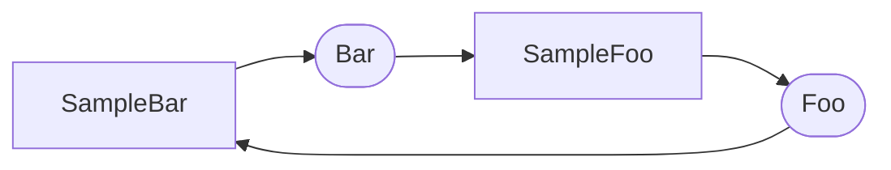

## 0. 概述

`nodelink`是一个轻量级的开发框架，目的是在不同平台上提供统一的模块开发、部署流程。当前`nodelink`提供了基础的部署和通信能力。

我们将每一个独立的算法或功能组件称为一个`node`（节点），各个`node`间可以使用Pub/Sub模式进行消息通信。

## 1. 创建节点

创建节点可以参考样例`nodelink/sample/sample_foo.h`以及`nodelink/sample/sample_bar.h`。样例提供了两个`node`：`SampleFoo`和`SampleBar`；
`SampleFoo`订阅topic为"Bar"的消息并发布topic为"Foo"的消息，`SampleBar`相反，订阅"Foo"、发布"Bar"。

详细的步骤：

### 1.1 创建节点目录

新建一个独立的目录，用于放置节点代码。

### 1.2 定义节点类

定义节点类，并继承自`Node`基类：

```c++
#include "nodelink/node.h"

class SampleFoo : public Node {
  // ...
};
```

### 1.3 重新实现`Init`

```c++
class SampleFoo : public Node {
 // ...
 public:
  int Init(const std::string& config) override;
};

int SampleFoo::Init(const std::string& config) {
    // 初始化节点
    // ...
    return 0;
}
```

必须重新实现继承的`Init`函数。`Init`的目的是初始化节点，其参数`config`是节点的配置文件路径，会在部署文件里指定（参考后面的部署描述）。

使用`Advertise()`创建发布者：

```c++
class SampleFoo : public Node {
 // ...
 private:
  PublisherPtr pub_foo_ = nullptr;
};

int SampleFoo::Init(const std::string& config) {
  // ...
  const std::string pub_topic = "Foo";
  pub_foo_ = Advertise(pub_topic);
  // ...
  return 0;
}
```

使用`Subscribe()`注册订阅回调：

```c++
class SampleFoo : public Node {
 // ...
 private:
  // 消息回调
  void OnBar(void* data, size_t size);
};

int SampleFoo::Init(const std::string& config) {
  // ...
  const std::string sub_topic = "Bar";
  auto callback = std::bind(&SampleFoo::OnBar, this, std::placeholders::_1, std::placeholders::_2);
  Subscribe(sub_topic, callback);
  // ...
  return 0;
}

void SampleFoo::OnBar(void* data, size_t size) {
  if (size != sizeof(DataBar)) {
    std::cout << "Error: wrong size, maybe data is mismatched";
    return;
  }
  auto* bar = (DataBar*)data;
  std::cout << "OnBar " << bar->bar << std::endl;
}
```

在需要发布消息的地方，使用`PublisherPtr`发布消息：

```c++
void SampleFoo::Proc() {
  for (int i = 0; i < 10; ++i) {
    DataFoo foo;
    foo.foo = i;
    // 发布消息
    pub_foo_->Pub(&foo, sizeof(foo));
  }
}
```

需注意的地方：

**注意1：** 如果节点需要订阅或发布消息，那**必须在`Init`中创建发布者`PublisherPtr`以及注册订阅**。

**注意2：** 消息回调的签名必须是`void (void* data, size_t size)`，其中`data`为收到的消息的地址，`size`为收到的消息的字节大小。

**注意3：** 如果有多个消息回调，那么各个消息回调的调用是同步的，即各个消息回调里不需要使用互斥锁进行数据竞争保护。

**注意4：** 如果消息回调的耗时很长，会阻塞底层消息的接收，可能出现丢帧；这时建议将耗时的业务放到一个单独的线程里处理，回调函数里只用来更新数据。

**注意5：** `Pub`的入参是`(void* data, size_t size)`，当前未提供数据的序列化与反序列化，因此**只能发送Plain数据**，不能发送复杂数据（比如包含vector的数据）。

> _何为Plain数据？_
>
> Plain数据指的是仅包含C++基础类型（int, double, bool, ....）或者基础类型的定长数组的数据。
>
> 比如下面类型是Plain数据：
>
> ```c++
> struct PlainData {
>   int a;
>   double b;
>   bool c;
>   char d[10];
> };
> ```
>
> 下面这个就不是Plain数据，因为包含`std::vector`和`std::string`（vector和string数据是分配在堆上的）：
>
> ```c++
> struct NotPlainData {
>   std::vector<int> a;
>   std::string b;
> };
> ```

**注意6：** 那如何发布复杂数据呢？可以使用外部序列化反序列化工具，比如protobuf；在`Pub`时传入序列化之后的数据，以及序列化之后的大小，在消息回调函数里拿到数据后进行反序列化。

### 1.3 重新实现`Start`

`Start`里放置启动核心业务的代码。

### 1.4 重新实现`Stop`

`Stop`里终止业务，并回收所有分配的资源。

### 1.5 注册节点

调用宏`REGISTER`注册节点：

```c++
class SampleFoo : public Node {
 // ...
};

REGISTER(SampleFoo);
```

`REGISTER`后的名字须是节点类名。后面的部署文件中配置的就是这个名字。

## 2. 部署、启动

### 2.1 配置部署文件

部署文件是一个yaml文件，在其中配置需要启动的所有节点。

参考样例`nodelink/sample/sample_deploy.yaml`：

```yaml
%YAML:1.0

nodes:
  - name: SampleFoo
    conf: "../modules/nodelink/sample/sample_foo.yaml"
    lib: "modules/nodelink/sample/liblocalization_nodelink_sample.so"
  - name: SampleBar
    conf: ""
    lib: "modules/nodelink/sample/liblocalization_nodelink_sample.so"
```

每一个节点需配置：

- name： `REGISTER`的节点名；
- conf：节点需要的配置文件路径，会传给节点的`Init`函数，如果不需要可留空；
- lib：节点编译的动态库路径。

### 2.2 启动

使用统一的bin启动节点：x86下是`hz_location_x86`，mdc下是`hz_location`。

用参数`--deploy`指定部署文件进行启动，比如：

```shell
$ cd build
$ ./modules/nodelink/hz_location/hz_location_x86 --deploy=../modules/nodelink/sample/sample_deploy.yaml
```

如果想查看各节点的消息拓扑，可以在启动时用参数`--topo`指定保存到的拓扑文件：

```shell
$ ./modules/nodelink/hz_location/hz_location_x86 --deploy=../modules/nodelink/sample/sample_deploy.yaml --topo=topo.md
```

输出的拓扑文件使用mermaid格式保存在markdown文件里，可以使用支持显示`mermaid`的工具打开（比如VSCode里安装markdown preview插件）。

上面例子生成的拓扑：


